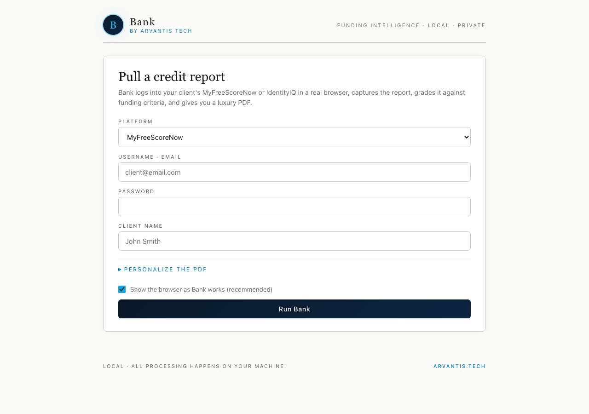

<div align="center">

# Bank

**The funding intelligence agent for credit professionals.**

Logs into MyFreeScoreNow or IdentityIQ. Pulls the report. Grades it against 9 funding-underwriter criteria. Returns a luxury PDF with a clear verdict — *Refer to Credit Repair*, *Qualified $30K-$75K*, or *Ideal $75K+*.

[](docs/screenshots/dashboard-form.png)

*The Bank dashboard. Local-first. Branded. No SaaS account required.*

</div>

---

## Why Bank exists

Most credit pros eyeball a credit report and guess at funding eligibility. That works until you scale. Bank standardizes the call:

- Same 9 criteria, every client, every time
- Per-bureau grading (because lenders use the lowest score)
- Verdict + funding range you can defend to a client on the call
- Luxury PDF you hand over instead of a screenshot

Two ways to use it. **Same engine.** Pick the door that fits how you work.

---

## Door 1 — Dashboard (no AI required)

A local webpage. You drop in client creds, watch a real browser log in and pull the report, and download the PDF.

```bash
git clone https://github.com/vantis123/bank.git
cd bank
npm install
npm start
```

Browser auto-opens to `http://localhost:7878`. That's it.

> **Mac shortcut:** double-click `Run Bank.command` after unzipping. It handles `npm install` + `npm start` for you.
>
> **Windows shortcut:** double-click `Run Bank.bat` after unzipping. Same one-click experience, runs through cmd so PowerShell's execution policy never gets in the way.

> **Don't have Node.js yet?** Grab the LTS version from [nodejs.org](https://nodejs.org/en/download) first (5 minutes, one-time setup).

See [INSTALL.md](INSTALL.md) for the step-by-step walkthrough if you've never used a terminal.

---

## Door 2 — MCP server (for Claude Code, Cursor, etc.)

Bank exposes 5 tools any MCP-compatible AI client can call. Add this to your `~/.claude/mcp.json` (or your client's equivalent):

```json
{
  "mcpServers": {
    "bank": {
      "command": "node",
      "args": ["/absolute/path/to/bank/apps/mcp-server/src/index.ts"]
    }
  }
}
```

Restart your AI client. Then prompt:

> *"Run a Bank report for John Smith. He's on MyFreeScoreNow, login is john@email.com, password is hunter2."*

Claude calls `bank_run_full` automatically. ~60 seconds later it responds with the verdict + a path to the PDF.

| Tool | What it does |
|---|---|
| `bank_capture` | Login + scrape FSN/IIQ → raw report text |
| `bank_parse` | Text → typed CreditReport JSON (auto-detects 4 FSN formats + IIQ) |
| `bank_score` | CreditReport → Scorecard with 9-criterion verdict |
| `bank_render` | CreditReport + Scorecard + client info → luxury PDF |
| `bank_run_full` | One call: capture → parse → score → render |

---

## The 9 funding criteria

Each criterion is graded **per bureau**. Any FAIL → *Refer to Credit Repair*. All PASS with stricter thresholds → *Ideal Profile*.

1. Credit score 680+ (lowest of 3 bureaus)
2. No collections / charge-offs / bankruptcies
3. No late payments in last 24 months
4. Under 2 hard inquiries per bureau
5. 3+ open accounts in good standing
6. Average account age 3+ years
7. Per-card utilization under 30%
8. Has a credit card with $5K+ limit
9. Has a credit card with $10K+ limit (AU acceptable)

---

## What runs locally

**Everything.** Bank doesn't phone home, doesn't upload reports, doesn't store credentials. Captured text and rendered PDFs live in `~/.bank/` on your machine. Delete that folder to wipe everything.

The dashboard runs on `localhost:7878`. The MCP server runs over stdio. No cloud, no account, no subscription.

---

## What's in this repo

```
bank/
├── apps/
│   ├── dashboard/         Local Express + vanilla web UI
│   └── mcp-server/        MCP stdio server (5 tools)
├── packages/
│   ├── parsers/           4 FSN formats + IIQ → typed CreditReport
│   ├── playwright-flows/  Login + capture (headed by default)
│   ├── funding-rules/     9-criterion scorecard engine
│   └── pdf-renderer/      Luxury Arvantis-branded PDF
├── INSTALL.md             Tester-friendly install guide
└── Run Bank.command       Mac one-click launcher
```

---

## Built by Arvantis Tech

Bank is the first agent in a growing portfolio of AI tools for credit professionals.

- 🌐 [app.arvantistech.com](https://app.arvantistech.com)
- 💬 More agents shipping soon — watch this profile

Distributed to Arvantis mentorship community members. Not for public redistribution.
